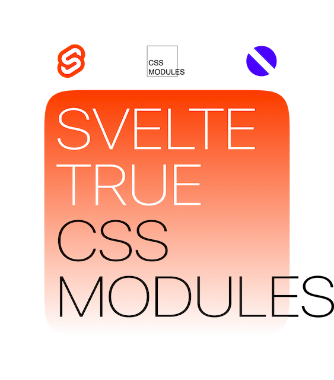

<p align="center">
    
</p>

<h2>Introduction</h2>

<b>Svelte True CSS Modules</b> is a preprocessor CSS modules for Svelte.

[Learn more about css modules](https://www.patreon.com/evanyou)

<h2>Example</h2>

Running through the `module` attribute and using the name of the classes through a variable anywhere.

```html
<script>
  // some code...
  let styles
  // some code...

  console.log(styles.main__title) // main__title_yr8Fgz23
</script>

<div class="{styles.main}">
  <h1 class="{styles.main__title}">Some title</h1>
</div>

<style module>
  .main {
    background-color: white;
  }

  .main__title {
    font-size: 72px;
  }
</style>
```

<h2>Installation</h2>

```bash
npm install --save-dev @naumstory/svelte-true-css-modules
```

<h3>Rollup</h3>

To be used with the plugin [`rollup-plugin-svelte`](https://github.com/sveltejs/rollup-plugin-svelte).

```js
import svelte from 'rollup-plugin-svelte';
import trueCssModules from '@naumstory/svelte-true-css-modules';

export default {
  ...
  plugins: [
    svelte({
      preprocess: [
        trueCssModules(),
      ]
    }),
  ]
  ...
}
```

<h3>Webpack</h3>

To be used with the loader [`svelte-loader`](https://github.com/sveltejs/svelte-loader).

```js
const cssModules = require('@naumstory/svelte-true-css-modules');

module.exports = {
  ...
  module: {
    rules: [
      {
        test: /\.svelte$/,
        exclude: /node_modules/,
        use: [
          {
            loader: 'svelte-loader',
            options: {
              preprocess: [
                trueCssModules(),
              ]
            }
          }
        ]
      }
    ]
  }
  ...
}
```

<h3>Options</h3>

Pass an object of the following properties

| Name | Type | Default | Description |
| --- | --- | --- | --- |
| `generateScopedName` | `{String}` | `"[local]_[hash:base64:8]"` | A rule using any available token (More details [here](https://github.com/webpack/loader-utils#interpolatename)) |
| `stylesVariableName` | `{String}` | `"styles"` | The name of the variable in which the class names will be placed |

<h2>Usage</h2>

To use css modules in the svelte component, add a `module` attribute to the style tag

```html
<style module>
  .main {
    background-color: white;
  }

  .main__title {
    font-size: 72px;
  }
</style>
```

To access the processed class names, you need to add the variable styles to any convenient location (a custom variable name can be specified in the plugin options).

```html
<script>
  // some code...
  let styles
  // some code...
</script>
```

Now you can use the new class names in the template and in any other place you need.

```html
<script>
  // some code...
  let styles
  // some code...

  console.log(styles.main__title) // main__title_yr8Fgz23
</script>

<div class="{styles.main}">
  <h1 class="{styles.main__title}">Some title</h1>
</div>

<style module>
  .main {
    background-color: white;
  }

  .main__title {
    font-size: 72px;
  }
</style>
```
